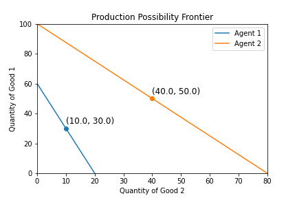

# Comparative Advantage, A Demonstration

In this demonstration, I discuss implications of comparative advantage, emphasizing those aspects relevant to the agent based model (ABM).

## Introduction
When we think about the cost of something, what comes to mind are dollar prices. More fundamentally, the cost of something is in terms of the other goods and services those same dollars could have purchased, including potential interest on savings and estimated value of our time. By choosing one activity, we simultaneously forgo alternative activities, the highest valued of which is called the "opportunity cost". If I choose to go for a walk in the evening rather than make dinner, then I can't use that time to make dinner. The opportunity cost of walking is the forgone dinner.

An "agent", whether a person, individual, household, firm, or country, is said to have a "comparative advantage" in the activity with the lowest opportunity cost relative to other agents. Imagine with one hour I can make one dinner or clean two rooms. My roommate can make two of the same dinners or clean two of the same rooms. Believe it or not we would not expect to find an economy where my roommate does both because they're measuredly better at both. The maniuplative "but you're better at it" doesn't work for long. Instead, assuming my roommate and I could overcome any barriers to trade, we would expect find an economy where my roommate cooks two dinners and I clean two rooms, then we "trade". Why? Because I clean rooms more cheaply, measured by opportunity costs. My roommate should buy cleaned rooms from me. With what do they "buy" these cleaned rooms? Dinners! **Upshot:** If everyone produces where they incur the least costs, the economy will produce goods at lower prices than if each agent produced those goods themselves.

## Production and Opportunity Cost
This demonstration consists of two "goods" (bread, butter, wine, mowed lawns) and two "agents" (people, households, firms, countries), with certain production capacities. An agent's "production capacity" is the amount of a good an agent could produce if they dedicated all of their available resources to its production. Table 1 shows the production capacity of two agents for two goods and the opportunitiy cost for each good. You can read the top left cell as: if Agent 1 dedicated all of their resources to the production of Good 1, they would produce 60 units of Good 1 and 0 units of Good 2.

Using the production capacities we can calculate the opportunity cost of each good. The opportunity cost of Good 1 is the amount of Good 2 that must be forgone (paid) to produce (buy) a unit of Good 1. That is, the opportunity cost of Good 1 is the "price" of Good 1 in terms of Good 2. From Table 1, Agent 1's opportunity cost (or price) of Good 1 is 0.33 Good 2. That is, Agent 1 must forgo the production of 0.33 units of Good 2 in order to produce an additional unit of Good 1. Similarly, Agent 2's opportunity cost of Good 2 is 1.25 units of Good 1. That is, the price for another unit of Good 2 is 1.25 units of Good 1.

#### Table 1: Production Capacities

|                   | Agent 1            | Agent 2             |
| ----------------- | ------------------ | ------------------- |
| Good 1            | 60                 | 100                 |
| Good 2            | 20                 | 80                  |
| Opp Cost of Good 1| 20 / 60 = **0.33** | 80 / 100 = 0.80     | 
| Opp Cost of Good 2| 60 / 20 = 3.00     | 100 / 80 = **1.25** |

An agent's "production possibility frontier" (PPF) are all combinations of Good 1 and Good 2 the agent could produce by spending all of their resources producing either good. Figure 1 illustrates each agent's PPF from Table 1. A straight line (linear) is drawn connecting agent's production possibility for each good, implying a constant marginal rate of transformation (MRT).[^1]

An agent is in "autarky" when an agent can only consume what they can produce. From now on, "autarky" should be what comes to mind when you hear about policies directed at "self-sufficiency" or "independence." "Self" in self-sufficient does not necessarily mean an individual, but any entity properly defined. A country could be self-sufficient if it does not trade with any other country, even though political entities within that country trade with each other. In autarky, agents split their resources between both goods.[^2] The result is that Agent 1 produces 30 and 10 of Good 1 and Good 2 and Agent 2 produces 50 and 40 of Good 1 and Good 2, plotted on Figure 1.

#### Figure 1: Agent Production Possibility Frontier

## Specialization
An agent's comparative advantage is in the production of the good where their opportunity cost is lowest. From Table 1, Agent 1 has a comparative advantage in the production of Good 1 (0.33 < 0.80) while Agent 2 has a comparative advantage in Good 2 (1.25 < 3.00). If agents were capable of discovering their comparative advantage, we would expect to find an economy where Agent 1 produced Good 1 and used it to trade for Good 2. That is, Agent 1 would specialize in producing Good 1, Agent 2 would specialize in producing Good 2, and the two agents would exchange. Textbook examples commonly suggest agents produce only their chosen specialty, however, this is not necessarily true. In reality, agents may produce *some* of the good they did not specialize in.  In the ABM, this occurs because agents run out of stock and cannot not completely satisfy demand at the agreed upon price.[^3]

When chosing their specializations, agents in the ABM do not know the production capabilities of other agents and must rely on the prices they see when interacting with neighboring agents to determine where their comparative advantage may lie. Agents compare their opportunity costs (their own price for a good) to the market prices for the same good to determine their specialization. **Upshot**: If the market price for a good is below the agent's opportunity cost of the same good, then it is cheaper to purchase the good at the market rate than to produce it. The agent purchases the cheaper good by producing or specializing in the other good.

## Price Determination

The benefits of specialization cannot be achieved without trade and the nature of exchange implies prices. Using each agent's opportunity costs we can determine a *range* of prices where specialization with trade would be beneficial.

If Agent 1 specializes in Good 1, then they would want to *sell* Good 1 and *buy* Good 2. Internally, Agent 1 "buys" a unit of Good 2 for 3 units of Good 1 (their opportunity cost of Good 1). If the market price for a unit of Good 2 is greater than 3 units of Good 1, then it would be cheaper for Agent 1 to produce Good 2 in autarky[^4]. In fact, a market price of Good 2 greater than 3 Good 1 should cause Agent 1 to assess specializing in the production of Good 2. **Result**: the maximum market price to buy Good 2 is 3 Good 1 and the minimum market price to sell Good 1 is 0.33 Good 2.

If Agent 2 specializes in Good 2, then they would want to *sell* Good 2 and *buy* Good 1. Internally, Agent 2 buys a unit of Good 1 for 0.80 units of Good 2 (their opportunity cost of Good 2). If the market price of a unit of Good 1 is greater than 0.80 Good 2, then it would be cheaper for Agent 2 to produce Good 1. **Result**: the maximum market price to buy Good 1 is 0.80 Good 2 and the minimum market price to sell Good 2 is 1.25 Good 1.

Let's put it all together. The market price of Good 1, that is, the amount of Good 2 required to purchase a unit of Good 1, must be high enough to entice Agent 1 to sell Good 1 and low enough to entice Agent 2 to buy Good 1. **Result:** The minimum market price is 0.38 Good 1 and the maximum market prices is 0.80, (0.33, 0.80). Inversely, minimum market price for Good 2 is 1.25 Good 1 and the maximum market price is 2.67 Good 1, (1.25, 3.67)[^5].

We can't say where in that range the prices will fall exactly. For the sake of the demonstration, let's continue as if the agents have agreed to exchange a unit of Good 1 for 0.34 units of Good 2--the minimum price at which Agent 1 would be willing to sell Good 1.

## Trade
Thus far, Agent 1 is specializing in Good 1 and Agent 2 is specializing in Good 2 and both agents have agreed on an exchange rate of a unit of Good 1 for 0.34 units of Good 2. How much trading can we expect to occur? At the agreed upon price, Agent 1 would be willing to *sell* 30 units of Good 1 for 10.20 of Good 2. Agent 2 would be willing to *buy* 117.65 Good 1 for 40 Good 2. However, Agent 2 is limited by the fact that Agent 1 is only willing to sell 30 Good 1. In fact, the amount Agent 2 wants to purchase exceeds the production capacitiy of Agent 1. **Result:** the agents agree to exchange 30 Good 1 for 10.20 Good 2.

After this round of trading occurs, Agent 1 will spend the rest of their resources producing an additional 30 units of Good 1, ending with 30 Good 1 and 10.20 Good 2, a total of 40.20 total units. This is 0.20 more units than the agent could produce alone in autarky. Intituitively, we know this situation is better than autarky because they can consume more Good 2 without forgoing any amount of Good 1. That is, through specialzation with trade, Agent 1 can consume more goods.

Agent 2 produced only 10.20 units of Good 2 to purchase Good 1, which is only 12.75% (10.20 / 80) of their resources. Agent 2 would spend their remaining resources producing 46.88 Good 2 and 28.60 Good 1, resulting in 58.60 Good 1 and 46.88 Good 2 and a total of 105.49 units. Despite being limited in trade, the result is 15.49 more units than could be produced in autarky. Again, we intuitively know this situation leaves Agent 2 better off since Agent 2 can now consume more of both goods.

Table 2 below summarizes the progression assuming each agent starts by producing only their specialized good. In Step 0, agents produced theier specialized good and in Step 1 they trade at the agreed upon price until Agent 1 no longer wants to trade. At that point, Agent 2 "trades with themselves" by giving up the amount of Good 2 they were not able to sell to Agent 1 and converting it to Good 1. The results are the same, but the order of events is different and unrealistic.

#### Table 2: Specialized Production with Trade

|        Step       |     Good          | Agent 1            | Agent 2               |
| ----------------- | ----------------- | ------------------ | --------------------- |
|          0        | Good 1            | 60                 | 0                     |
|                   | Good 2            | 0                  | 80                    |
|          1        | Good 1            | 30                 | 30                    |
|                   | Good 2            | 30 * 0.34 = 10.20  | 80 - 10.20 = 69.80    |
|          2        | Good 1            | 30                 | 30 + 26.60 = 56.60    |
|                   | Good 2            | 10.20              | 69.80 - 22.92 = 46.88 |

Figure 2 summarizes the same steps but shows the decisions as points on a graph as agents move along various lines.

#### Figure 2: Specialization with Trade

<!-- ## Distribution of Goods

If prices have a range, so does the potential final distribution of goods. Below are two tables showing the final distribution of goods at the minimum and maximum market price of Good 1.

#### Specialization with Trade at Minimum Price (Good 1 = 0.39 Good 2)
|        | Entity 1 | Entity 2 | Total Production |
| ------ | -------- | -------- | ---------------- |
| Good 1 | 40       | 40       | 80               |
| Good 2 | 15.60    | 64.40    | 80               |
| Total  | 55.60    | 104.40   | 160              |

#### Specialization with Trade at Maximum Price (Good 1 = 0.79 Good 2)
|        | Entity 1 | Entity 2 | Total Production |
| ------ | -------- | -------- | ---------------- |
| Good 1 | 40       | 40       | 60               |
| Good 2 | 31.60    | 48.40    | 80               |
| Total  | 71.60    | 88.40    | 160              | -->

[^1]: You can use many functions to connect two points. In this case, I choose to connect using a linear function. If you change the function, you change optimal production choices, but none of the conclusions from the model change. Still it would be nice to generalize this ABM to take multiple production functions.

[^2]: Intutively, think of it this way, if Agent 1 instead produced in autarky 11 Good 1 and 29.66 Good 2. The ratio of Good 1 to Good 2 is 0.37, which means you paid too much for Good 2 (0.37 > 0.33). If this doesn't sound convicing, then you are going to have to wait until I explicitly add utility functions. The result amounts to maximizing utility function $U(x,y) = x*y$.

[^3]: It is rarely worth debating definitions. I do want to note that by design specialization turns into "commodification". That is, in the ABM, the agents specialization is the amount of the good an agent produces for trade, which is the definition of a commodity.

[^4]: The other option is to switch to specializing in the more expensive good. No doubt an import consideration for any model of the market process. However, the process by which agents discover their comparative advantage is not the ponint here. The goal is to derive the price ranges required for trade of occur where agents are specializing where they have a comparative advantage.

[^5]: At exactly the maximum/minimum prices, at least one agent would be indifferent between autarky and specialization with exchange. Therefore, I put the range in parenthese instead of brackets to indicate that the limits are not reached.

[^6]: For Agent 1, the equation is $(60 - Q_{1}) / (0 + 0.34 \times Q_{1}) = 0.34$. $Q_{1}$

[^7]: For Agent 2, the equation is $(0 + Q_{1}) / (80 - 2.94 \times Q_{1}) = 0.34$
