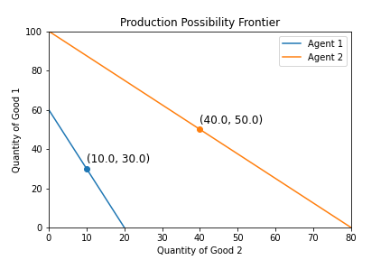

# Comparative Advantage

## An Introduction
Intuitively, when we think about costs we are thinking of the dollar price. More fundamentally, the concept of opportunity cost puts the cost in terms of the other goods and services those same dollars could have purchased, including potential forgone interest on savings and estimated value of your time. By choosing one activity, you simultaneously forgo alternative activities, the highest valued of which is called the opportunity cost. If I choose to go for a walk in the evening rather than make dinner, then I can't use that time to make dinner. The opportunity cost of walking is the forgone dinner.

An "agent", whether a person, individual, household, firm, or country, is said to have a "comparative advantage" in the activity with the lowest opportunity cost relative to other agents. Imagine with one hour I can make one dinner or clean two rooms. My roommate can make two of the same dinners or clean two of the same rooms. In this world, believe it or not, we would not expect my roommate to be doing both just because they're measuredly better at both. The maniuplative "but you're better at it" doesn't work here! Instead, we would expect find an economy where my roommate cooks two dinners and I clean two rooms, then we "trade". Why? Because I clean rooms more cheaply, measured by opportunity costs. My roommate should buy cleaned rooms from me. With what do they "buy" these cleaned rooms? Dinners! **Upshot:** If everyone produces where they incur the least costs, the economy will produce goods at lower prices than if each agent produced those goods themselves.

## Production and Opportunity Cost
In this demonstration there are "goods" (bread, butter, wine, mowed lawns) and "agents" (people, households, firms, countries), with certain production capacities. An agent's "production capacity" is the amount of a good an agent could produce if they dedicated all of their available time and resources to its production. Table 1 shows the production capacity of two agents for two goods. You can read the top left cell as: if Agent 1 dedicated all of their resources to the production of Good 1, they would produce 60 units of Good 1 and 0 units of Good 2.

Using the production capacities we can calculate the opportunity cost of each good. The opportunity cost of Good 1 is the amount of Good 2 that must be forgone (paid) to produce (buy) a unit of Good 1. That is, the opportunity cost of Good 1 is the "price" of Good 1 in terms of Good 2. Agent 1's opportunity cost (or price) of Good 1 is 0.33 Good 2. That is, Agent 1 must forgo production of 0.33 units of Good 2 in order to produce an additional unit of Good 1. Similarly, Agent 2's opportunity cost of Good 2 is 1.25 units of Good 1. That is, the price for another unit of Good 2 is 1.25 units of Good 1.

#### Table 1: Production Capacities

|                   | Agent 1            | Agent 2             |
| ----------------- | ------------------ | ------------------- |
| Good 1            | 60                 | 100                 |
| Good 2            | 20                 | 80                  |
| Opp Cost of Good 1| 20 / 60 = **0.33** | 80 / 100 = 0.80     | 
| Opp Cost of Good 2| 60 / 20 = 3.00     | 100 / 80 = **1.25** |

An agent is in "autarky" when an agent can only consume what they can produce--no trading. This is what should come to mind when policies are directed towards "self-sufficiency" or "independence." "Self" in self-sufficient does not necessarily mean an individual, but any entity properly defined. A country could be self-sufficient if it does not trade with any other country, even though political entities within that country trade with each other.

Figure 1 illustrates each agents production possibility fontier (PPF) from Table 1 and the amount of Good 1 and Good 2 produced in autarky. A straight line (linear) is drawn connecting agent's production possibility for each good, implying a constant marginal rate of transformation (MRT). Agents produce until the ratio of Good 1 to Good 2 equals the opportunity cost of Good 2 (and vice versa). This will also be the case when trade is introduced. In autarky, the result is that Agent 1 produces 30 and 10 of Good 1 and Good 2 and Agent 2 produces 50 and 40 of Good 1 and Good 2.[^1]

#### Figure 1: Agent Production Possibility Frontier

### Specialization (Commodification)
To restate, an agent's comparative advantage is in the production of the good where their opportunity cost is lower than other agents. On Table 1, Agent 1 has a comparative advantage in the production of Good 1 (0.33 < 0.80) while Agent 2 has a comparative advantage in Good 2 (1.25 < 3.00). If agents were capable of discovering their comparative advantage, we would expect to find an economy where Agent 1 produced Good 1 and used it to trade for Good 2. Vice versa for Agent 2. That is, Agent 1 would specialize in producing Good 1, Agent 2 would specialize in producing Good 2 and they would exchange.

Textbook examples commonly suggest agents produce only their chosen specialty, however, this is not necessarily true. In both reality and in the agent based model, agents may produce *some* of the good they did not specialize in. You don't necessarily trade for all your meals or home repairs. In the agent based model, agents can run out of stock, so supply may not satisfy demand at the agreed upon price.[^3]

### Trade
Given the specialization for each agent, what trades can we expect in this economy? In order for a trade to take place, three aspects need to be decided. Table 2 walks us through one possible answer. First, at T = 0, each agent specializes in the good where they have a comparative advantage. Agent 1 dedicates their resources to producing 60 Good 1 and 0 Good 2 and Agent 2 to producing 0 Good 1 and 80 Good 2.

Now assume the agents have agreed to exchange a unit of Good 1 for 0.34 units of Good 2 (we haven't discussed price determination yet). I picked this number as it happens to be the lowest price I think Agent 1 would be willing to sell Good 1. Why? If it was 0.32 units of Good 2, then it would be cheaper for Agent 1 to produce Good 2. If the price was 0.33 units of Good 2, then it would equal Agent 1's opportunity cost, leaving them indifferent. In which case, why bother with trading? If it was 0.34 Good 2 or greater, than it would be cheaper for Agent 1 to exchange Good 1 for Good 2. The same analysis applies to Agent 2. In fact, Agent 2 would be willing to trade for Good 1 using Good 2 long as the price for Good 1 was below 0.80 Good 2. **Upshot**: if the market price for a good is below the agent's opportunity cost of the same good, then it is cheaper to purchase the good in at the market rate than to produce it.

At the assumed price of 0.34 units of Good 2, where does trading get our agents? Agent 1 would be willing to sell Good 1 until   In addition, assume Agent 1 has agreed to sell 30 Good 1 for 10.20 Good 2. This second assumption is not necessary if both agents can buy as much as they want at the agreed upon price. However, that is not always going to be the case in the agent-based model, so let's make explicit that quantity may be a limiting factor.

Table 2 shows that initially agents specialize where they have a comparative advantage.  In the next step, agents begin to trade

#### Table 2: Specialized Production with Trade

|        Time       |     Good          | Agent 1            | Agent 2             |
| ----------------- | ----------------- | ------------------ | ------------------- |
|          0        | Good 1            | 60                 | 0                   |
|                   | Good 2            | 0                  | 80                  |
|          1        | Good 1            | 30                 | 30                  |
|                   | Good 2            | 30 * 0.34 = 10.20  | 80 - 10.20 = 69.80  |
|          2        | Good 1            | 30                 | 30                  |
|                   | Good 2            | 30 * 0.34 = 10.20  | 80 - 10.20 = 69.80  |

Before moving on, lets use these numbers to assess a situation. Say Agent 1 walks into a supermarket, finds the isle with Good 1 on it, and sees a price of 0.34 Good 2. Would Agent 1 purchase Good 1 from this supermarket? The market is asking for 0.34 units of Good 2 for each unit of Good 1. However, Agent 1's opportunity cost of Good 1 is only only 0.33 units of Good 2. Therefore, it is cheaper for Agent 1 to produce Good 1 since their opporunity cost is below the market price. In fact, after seeing this valuable piece of information, Agent 1 should consider *specializing* in the production of Good 1 and *selling* each unit of Good 1 for 0.34 Good 2. In this situation, the market is signaling that Agent 1 may have a comparative advantage in the production of Good 1. If the market price for Good 1 was below Agent 1's opportunity cost, then the market would be signalling to Agent 1 that they have a comparative advantage in the production of Good 1, which is what Table 1 suggests. What this story is meant to convey that in the real world, prices are the main signal agents use to assess their comparative advantages.

### Price Determination

The benefits of specialization cannot be achieved without trade and the nature of exchange implies prices. Using each entity's opportunity costs we can determine a *range* of prices where specialization with trade would be beneficial.

If Entity 1 specializes in Good 1, then they would want to *sell* Good 1 and *buy* Good 2. Internally, Entity 1 "buys" a unit of Good 2 for 3 units of Good 1 (their opportunity cost of Good 1). If the market price for a unit of Good 2 is greater than 3 units of Good 1, then it would be cheaper for Entity 1 to produce Good 2 in autarky[^1]. Result: the maximum market price to buy Good 2 is 3 Good 1 and the minimum market price to sell Good 1 is 0.33 Good 2.

If Entity 2 specializes in Good 2, then they would want to *sell* Good 2 and *buy* Good 1. Internally, Entity 2 buys a unit of Good 1 for 0.80 units of Good 2 (their opportunity cost of Good 2). If the market price of a unit of Good 1 is greater than 0.80 Good 2, then it would be cheaper for Entity 2 to produce Good 1. Result: the maximum market price to buy Good 1 is 0.80 Good 2 and the minimum market price to sell Good 2 is 1.25 Good 1.

Let's put it all together. The market price of Good 1, that is, the amount of Good 2 required to purchase a unit of Good 1, must be high enough to entice Entity 1 to sell Good 1 and low enough to entice Entity 2 to buy Good 1. The minimum market price is 0.38 Good 1 and the maximum market prices is 0.80, (0.33, 0.80). Inversely, minimum market price for Good 2 is 1.25 Good 1 and the maximum market price is 2.67 Good 1, (1.25, 3.67)[^2].

In autarky, each entities splits their time producing both goods, totaling 130 units in the economy. Through specialization, total production would increase to 150 units, a 10% increase in total goods produced.

#### Autarky:
|        | Entity 1 | Entity 2 | Total Production |
| ------ | -------- | -------- | ---------------- |
| Good 1 | 30       | 50       | 90               |
| Good 2 | 10       | 40       | 55               |
| Total  | 40       | 90       | **130**          |

#### Specialization:
|        | Entity 1 | Entity 2 | Total Production |
| ------ | -------- | -------- | ---------------- |
| Good 1 | **60**   | 0        | 60               |
| Good 2 | 0        | **80**   | 80               |
| Total  | 60       | 80       | **140**          |

### Distribution of Goods

If prices have a range, so does the potential final distribution of goods. Below are two tables showing the final distribution of goods at the minimum and maximum market price of Good 1.

#### Specialization with Trade at Minimum Price (Good 1 = 0.39 Good 2)
|        | Entity 1 | Entity 2 | Total Production |
| ------ | -------- | -------- | ---------------- |
| Good 1 | 40       | 40       | 80               |
| Good 2 | 15.60    | 64.40    | 80               |
| Total  | 55.60    | 104.40   | 160              |

#### Specialization with Trade at Maximum Price (Good 1 = 0.79 Good 2)
|        | Entity 1 | Entity 2 | Total Production |
| ------ | -------- | -------- | ---------------- |
| Good 1 | 40       | 40       | 60               |
| Good 2 | 31.60    | 48.40    | 80               |
| Total  | 71.60    | 88.40    | 160              |

[^1]: This amounts to maximizing utility function $U(x,y) = x*y$. In this iteration of the agent based model, I don't think I want to go into utility functions, so I state the optimal case.

[^2]: Potentially more accurate phrasing of an agent's specialty would be "commodity", where the amount of a good an agent produces is intended for sale.

[^3]: The other option is to switch to specializing in the more expensive good. No doubt an import consideration for any model of the market process. However, the process by which agents discover their comparative advantage is not the ponint here. The goal is to derive the price ranges required for trade of occur where agents are specializing where they have a comparative advantage.

[^4]: At exactly the maximum/minimum prices, at least one agent would be indifferent between autarky and specialization with exchange. Therefore, I put the range in parenthese instead of brackets to indicate that the limits are not reached.